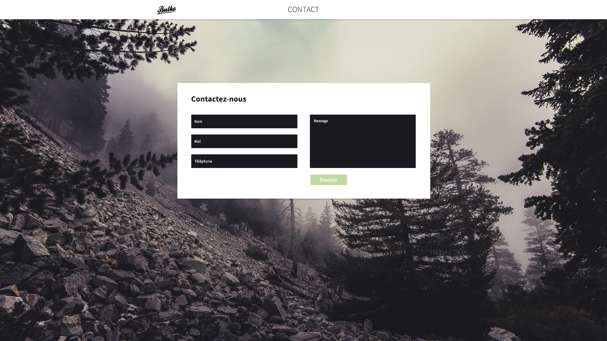

#  Test stage

Intégration responsive HTML/CSS du document Photoshop `maquette/formulaire.psd`.
* Si besoin, le document est prédécoupé dans le dossier `/asset`.
* La gestion des points de rupture est laissée libre.

Vérifications sur le formulaire *(JS et/ou PHP)*:
* Adresse e-mail correcte *(obligatoire)*.
* Téléphone à 10 chiffres commençant par «0» *(obligatoire)*.
* Les champs `nom` et `message` sont facultatifs.
* Une protection anti injection SQL doit être présente sur l'ensemble des champs.

Traitement du formulaire
* Affichage des données brutes sur une seconde page.
* Pas d'envoi d'email demandé.

Livrable 
* URL d'un repo git public *(choix de la plateforme libre, fork du repo recommandé)*.
* Veillez à organiser vos commit *(message et fréquence)*.
* Pas de limitation de temps pour la remise du test.
* Transmettre par email l'url du repo ainsi que le temps de production. 

----

>	L'utilisation d'un préprocesseur CSS est **autorisée**.   
>	L'utilisation de jQuery ou Angular est **autorisée**.   
>	L'utilisation de framework CSS n'est **pas autorisée**.   
>	L'utilisation de framework PHP  n'est **pas autorisée**.   

# 
>	maquette/formulaire.psd

© 2016  